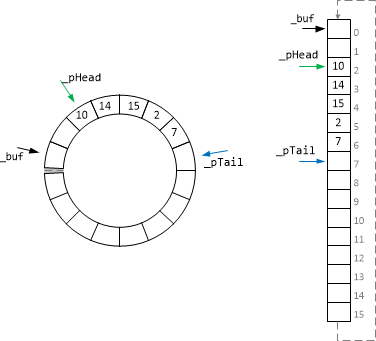

One of the most common data structures "queue" implements the FIFO principle of managing elements -- first input/first output. Queues are ubiquitous in IT when the number of incoming tasks exceeds the bandwidth of a component processing them. In this case, tasks are buffered, that is, they are queued for execution. The order of their execution must correspond to the order of placing them in the queue. A task that remains in a queue longer than the others must be
executed first, as soon as the resources of the processing component are released for that.

The Queue ADT can have different internal implementations, depending on its scope. One such possible implementation is the Ring Buffer. A circular buffer is an array of elements, the end of which is logically connected to the beginning, that is, together they represent a continuous
sequence of elements (Fig. 1). In reality, a circular buffer is represented using an ordinary array of a given length, however, when operating with it using a pointer, when the end of the buffer is reached, the pointer moves to the beginning, as if there were no gap between the first and last elements of the array. Ring buffers are especially common in memory-constrained systems and when dynamic dynamic memory allocation is inefficient or undesirable.

Fig. 1 Ring Buffer and its flat implementation

The main goal of this project is to implement a queue structure based on a ring buffer for storing elements of an arbitrary data type. To do this, you need to implement the template class `RingBuffer` with a parameter `T`, which determines the type of the stored elements. The buffer elements are stored in a C-style array, the size of which becomes known only at the construction stage of an instance of class `RingBuffer`, so memory for the elements of this array is allocated in
the heap. To perform the correct freeing of memory from the array, it is necessary to implement a destructor, and for correct copying of the array a copy constructor and an assignment operation are to be implemented. Auxiliary pointers are used to correctly navigate the circular buffer when adding and retrieving items.
